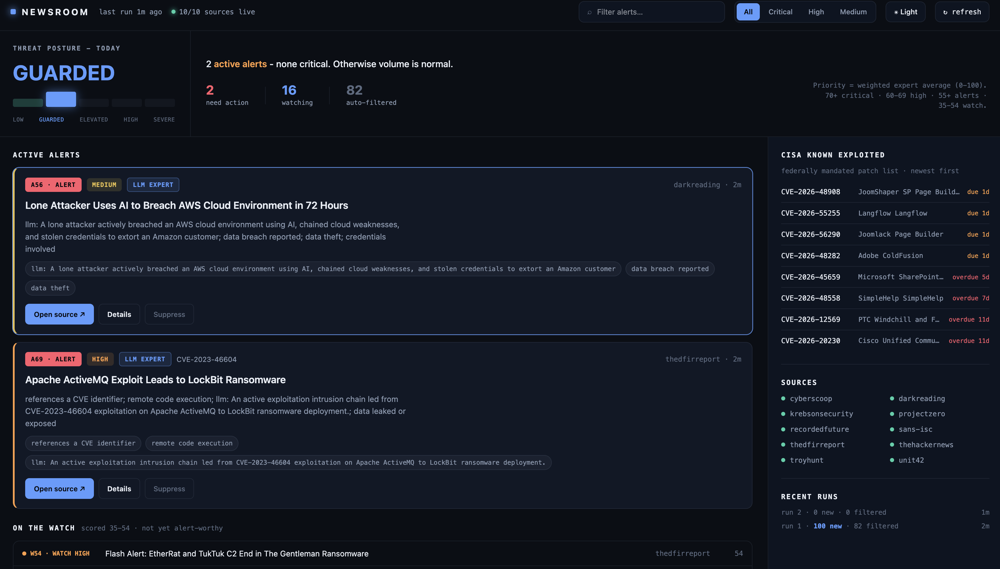

# NewsRoom

NewsRoom is a local cyber-threat situation monitor. It ingests curated security
RSS feeds, deduplicates articles, enriches CVE mentions with CISA KEV, scores
items with specialist classifiers, and serves a loopback dashboard for alert
triage.

The default pipeline is deterministic. An optional live LLM can replace the
`active_attack` specialist, but it stays behind the same safety gates, evidence
checks, and routing controls as the static classifiers.

```text
feeds -> normalize/dedupe -> KEV enrichment -> safety gates
      -> specialist classifiers -> evidence review -> coordinator
      -> SQLite/artifacts -> local dashboard
```

## Solution Overview



The dashboard shows current alert posture, active alerts, watchlist items,
CISA KEV context, source health, and recent runs. Rows marked `LLM EXPERT`
were reviewed by the live LLM-backed active-attack specialist.

## What It Does

- Reads trusted security feeds configured in [config.yaml](config.yaml).
- Classifies each article for vulnerability relevance, active exploitation,
  breach impact, and confidence.
- Suppresses thin, stale, low-confidence, or weakly grounded items.
- Adds a CISA KEV boost when an article mentions a known exploited CVE.
- Maintains an alert-once lifecycle in SQLite so repeat sightings update
  existing alerts instead of creating duplicates.
- Displays alerts, watchlist items, source health, KEV context, and run history
  at [http://127.0.0.1:8765](http://127.0.0.1:8765).

## Design And Technology

- **Untrusted content boundary**: article text is attacker-controlled input.
  Classifiers inspect it, but the coordinator only consumes validated evidence
  ledger entries.
- **Evidence-first scoring**: positive findings need source evidence. LLM
  findings must be grounded in the current article before they affect routing.
- **Deterministic baseline**: regex specialists work without credentials,
  remote model calls, or hidden state.
- **Bounded LLM path**: provider-specific code lives in
  `src/newsroom/llm_wire.py`; classifier logic only depends on the shared LLM
  interface.
- **Local-first stack**: Python 3.11+, Pydantic, LangGraph, SQLite, and vanilla
  HTML/CSS/JavaScript.

## Run Locally

```bash
python3 -m venv .venv
source .venv/bin/activate
pip install -e ".[dev]"
pytest
```

Offline demo:

```bash
newsroom run --fixture tests/fixtures/rss_sample.xml
```

Live monitor:

```bash
newsroom watch
```

Useful commands:

```bash
newsroom run --config config.yaml
newsroom serve
newsroom auth status
```

## LLM Mode

LLM usage is disabled by default. Configure `llm.provider`, `llm.model`, and
limits in `config.yaml`, then authenticate through the provider SDK or
environment. When enabled, `active_attack` becomes an LLM-backed specialist;
the existing regex result is passed as trusted context and remains the fallback
for provider errors, malformed output, ungrounded claims, blocked input, or
spend caps. Dashboard rows that used the live path are marked `LLM EXPERT`.

Key guardrails:

- Prompt-injection tripwires run before model calls.
- Article text is redacted, normalized, and wrapped with per-call spotlighting
  delimiters.
- Model calls receive a separate safety system prompt.
- Providers receive no tools, browsing, file, memory, write, or delivery
  authority.
- Responses must match a strict Pydantic schema with bounded fields and no
  extra keys.
- Evidence strings and source references must match the current article before
  findings are promoted.
- Provider errors are redacted before logging or display.
- `max_items`, token limits, provider timeouts, and retry caps bound cost and
  resource use.

## Wire An LLM Locally

The committed [config.yaml](config.yaml) already contains a ready-but-disabled
LLM configuration. Provider and model names are not secrets; credentials stay
outside the repo and are resolved by the provider SDK or environment.

NewsRoom currently supports `anthropic`, `openai`, and `fake` providers.

Authenticate a provider:

```bash
# Anthropic: browser link flow when the ant CLI is installed, or use
# ANTHROPIC_API_KEY from the environment.
newsroom auth login anthropic
newsroom auth status anthropic

# OpenAI: use OPENAI_API_KEY from the environment.
export OPENAI_API_KEY="sk-..."
newsroom auth status openai
```

Use the default Anthropic settings in `config.yaml`, or switch provider/model
there:

```yaml
llm:
  enabled: false
  provider: anthropic
  model: claude-opus-4-8
  triage_enabled: false
  max_items: 100
```

For OpenAI, change `provider` to `openai` and `model` to `gpt-5.1`.

Run one live pull with the LLM enabled for that command:

```bash
rm -rf output
newsroom run --config config.yaml --llm
```

Alternatively, set `llm.enabled: true` in `config.yaml` and omit `--llm`:

```bash
newsroom run --config config.yaml
```

Check whether the active-attack specialist used the model:

```bash
python - <<'PY'
import json
from collections import Counter

modes = Counter()
for line in open("output/agent_trace.jsonl"):
    row = json.loads(line)
    if row.get("agent_id") == "campaign_agent" and row.get("action") == "llm_classify":
        modes[row.get("details", {}).get("mode", "unknown")] += 1

print(dict(modes))
PY
```

Expected modes:

- `llm`: the live model result was accepted.
- `regex_fallback`: the model was attempted, but guardrails rejected the result
  or the provider failed, so the deterministic classifier was used.
- `regex_capped`: `llm.max_items` was reached before all parsed articles were
  reviewed by the model.

Start the dashboard from the live database:

```bash
newsroom serve --db-path output/newsroom.db --port 8765
```

Open [http://127.0.0.1:8765](http://127.0.0.1:8765). For continuous live
collection and dashboard serving in one process:

```bash
newsroom watch --config config.yaml --llm --interval 900 --port 8765
```

Rows marked `LLM EXPERT` were accepted from the live LLM active-attack path.
A true on-device/local-model provider is not implemented yet; add that behind
the `LLMProvider` interface in `src/newsroom/llm_wire.py`.

## Configuration

[config.yaml](config.yaml) controls feed sources, trust levels, KEV refresh,
thresholds, classifier weights, LLM provider settings, output paths, source
limits, and fetch timeouts.

Common CLI overrides: `--threshold`, `--limit`, `--fixture`, `--output-dir`,
`--db-path`, `--llm`, `--no-kev`, `--interval`, and `--port`.

## Outputs And API

Runs write JSON/JSONL artifacts and SQLite state under `output/`, including
alerts, decisions, the evidence ledger, agent traces, safety reports, run
manifests, and dashboard `data.json`.

Loopback API endpoints:

```text
GET  /api/summary
GET  /api/alerts
GET  /api/decisions?q=&decision=
GET  /api/timeline?days=
GET  /api/sources
GET  /api/kev
GET  /api/runs
POST /api/alerts/<id>/review   X-NewsRoom: review required
```

## Repository Map

```text
src/newsroom/ingest/        RSS and KEV ingestion
src/newsroom/classifiers/   deterministic and LLM-backed specialists
src/newsroom/llm.py         prompts, schema, safety, validation
src/newsroom/llm_wire.py    provider adapters
src/newsroom/safety.py      redaction and injection tripwires
src/newsroom/workflow.py    run pipeline
src/newsroom/store.py       SQLite persistence
src/newsroom/server.py      loopback API and dashboard server
src/newsroom/web/           dashboard assets
tests/                      offline unit and workflow tests
```

## Failure Behavior

Feed failures are recorded in source health and do not stop the run. KEV fetch
failure falls back to the cached catalog when available. Failed scheduled runs
are recorded while `newsroom watch` continues. Misconfigured LLM mode exits
with a clear error, and LLM provider failures fall back to deterministic
scoring for the affected item.
